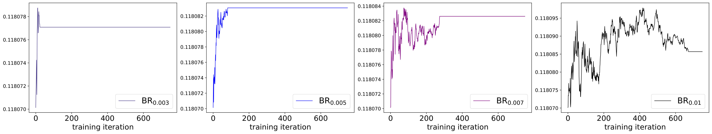

# OFQ: Oscillation-free Quantization for Low-bit Vision Transformers

This repository contains the training code of ViT introduced in our work: "[Oscillation-free Quantization for Low-bit Vision Transformers](https://arxiv.org/abs/2302.02210)" which has been accepted for ICML 2023.

In this work, we discusses the issue of weight oscillation in quantization-aware training and how it negatively affects model performance. The learnable scaling factor, commonly used in quantization, was found to worsen weight oscillation. The study proposes three techniques to address this issue: statistical weight quantization (StatsQ), confidence-guided annealing (CGA), and query-key reparameterization (QKR). These techniques were tested on the ViT model and were found to improve quantization robustness and accuracy. The proposed 2-bit DeiT-T/DeiT-S algorithms outperform the previous state-of-the-art by 9.8% and 7.7%, respectively.


<div align=center>

<figcaption font-size = 8px align = "center"><b>Fig.1 - Trajectory of statistical scaling factors (StatsQ) from the 10th transformer blocks in a 2-bit DeiT-S throughout CGA with 4 different boundary ranges [BR_0.003, BR_0.005, BR_0.007, BR_0.01]. The y-axis represents the value of scaling factorsß</b></figcaption>
</div>

## Run

### 1. Requirements:
```
conda create -n ofq python=3.8
conda activate ofq
python3 -m pip install numpy==1.22.3
python3 -m pip install torch==2.0.0 torchvision==0.15.1
python3 -m pip install timm=0.5.4
python3 -m pip install pyyaml
```
Please replace "/your/miniconda3/envs/ofq/lib/python3.8/site-packages/timm/data/dataset_factory.py" with "timm_fix_imagenet_loading_bugs/dataset_factory.py" as with the original code there is a "TypeError: __init__() got an unexpected keyword argument 'download'" error.

### 2. Data:
* Download [ILSVRC12 ImageNet classification dataset](https://www.image-net.org/download.php)

### 3. Pretrained models:
* Pretrained models will be automatically downloaded for you if set args.pretrained to True.

### 4. Steps to run:
* Examples of training scripts, finetuning scripts (CGA) are provided under "train_scripts/" and evaluation scripts are under "eval_scripts/" (please use the exact same batch size (batch_size * world_size) as provided in the evaluation scripts to reproduce the results reported in the paper). 

* Please modified the data path to your own dataset address

## Models
### 1. ImageNet1K dataset

| Models | #Bits | Top-1 Accuracy | eval script |
| --- | --- | --- | ------- |
| DeiT-T |  32-32 | 72.02 | ------- |
| OFQ DeiT-T | 2-2 | [**64.33**](https://hkustconnect-my.sharepoint.com/:u:/g/personal/sliuau_connect_ust_hk/ETacXA4nZxtBuJ2RSVO6GToBqe6M8vnL0hXo75msagLKDw?e=RdConK)| eval_scripts/deit_t/w2a2.sh |
| OFQ DeiT-T | 3-3 | [**72.72**](https://hkustconnect-my.sharepoint.com/:u:/g/personal/sliuau_connect_ust_hk/EQB7riAo9y1GpX5Tr3bChqIBYetCcIHfR2xdxJACqvAuLw?e=VeHOm6) | eval_scripts/deit_t/w3a3.sh |
| OFQ DeiT-T | 4-4 | [**75.46**](https://hkustconnect-my.sharepoint.com/:u:/g/personal/sliuau_connect_ust_hk/Ebo0I7E5_4xMqfThmh3zpgkB77BWrWSyx5NzJqm-mDsGVg?e=23S3Bz) | eval_scripts/deit_t/w3a3.sh |
| DeiT-S |  32-32 | 79.9 | ------- |
| OFQ DeiT-S | 2-2 | [**75.72**](https://hkustconnect-my.sharepoint.com/:u:/g/personal/sliuau_connect_ust_hk/EQEHW7tDmYpNjULhtUFpf2cB9EfIQrsN2LPF846TVNe2cg?e=eBqu6S) | eval_scripts/deit_s/w2a2.sh |
| OFQ DeiT-S | 3-3 | [**79.57**](https://hkustconnect-my.sharepoint.com/:u:/g/personal/sliuau_connect_ust_hk/ESMKhGXDKT1HjFzCKrSYOvgB9SfXQ5u_46HnIt0LIMS5MQ?e=4cBdYU) | eval_scripts/deit_s/w3a3.sh |
| OFQ DeiT-S | 4-4 | [**81.10**](https://hkustconnect-my.sharepoint.com/:u:/g/personal/sliuau_connect_ust_hk/EQ-KvPjXiI5GiZB-r03hcm8B_Q0M0cZ4b0Rj59RWiQ8ZtA?e=Lk4GjR) | eval_scripts/deit_s/w4a4.sh |
| Swin-T |  32-32 | 81.2 | ------- |
| OFQ Swin-T | 2-2 | [**78.52**](https://hkustconnect-my.sharepoint.com/:u:/g/personal/sliuau_connect_ust_hk/EWl2BPKk2qpCv0uZ1VGYa2QBGog9ZmpckGco-A1aNLrxhA?e=Eh2X1X) | eval_scripts/swin_t/w2a2.sh |
| OFQ Swin-T | 3-3 | [**81.09**](https://hkustconnect-my.sharepoint.com/:u:/g/personal/sliuau_connect_ust_hk/ETnNiYGeG9JOnLgJAIzbXFIBlaovFZ-RoZkC95-FrLP9yA?e=gB77Vv) | eval_scripts/swin_t/w3a3.sh |
| OFQ Swin-T | 4-4 | [**81.88**](https://hkustconnect-my.sharepoint.com/:u:/g/personal/sliuau_connect_ust_hk/EX9WmBLUQsBNqWscdm1cIcQBWe6Yt5EARN0xoD12IOrE-g?e=cmuFle) | eval_scripts/swin_t/w4a4.sh |

## Acknowledgement

The original code is borrowed from [DeiT](https://github.com/facebookresearch/deit).

## Citation

If you find our code useful for your research, please consider citing:
```bibtex
@misc{https://doi.org/10.48550/arxiv.2302.02210,
  doi = {10.48550/ARXIV.2302.02210},
  url = {https://arxiv.org/abs/2302.02210},
  author = {Liu, Shih-Yang and Liu, Zechun and Cheng, Kwang-Ting},
  keywords = {Computer Vision and Pattern Recognition (cs.CV), Artificial Intelligence (cs.AI), Hardware Architecture (cs.AR), Machine Learning (cs.LG), FOS: Computer and information sciences, FOS: Computer and information sciences},
  title = {Oscillation-free Quantization for Low-bit Vision Transformers},
  publisher = {arXiv},
  year = {2023},
  copyright = {arXiv.org perpetual, non-exclusive license}
}
```

## Contact

Shih-Yang Liu, HKUST (sliuau at connect.ust.hk)

## License
OFQ is CC-BY-NC 4.0 licensed as of now.

